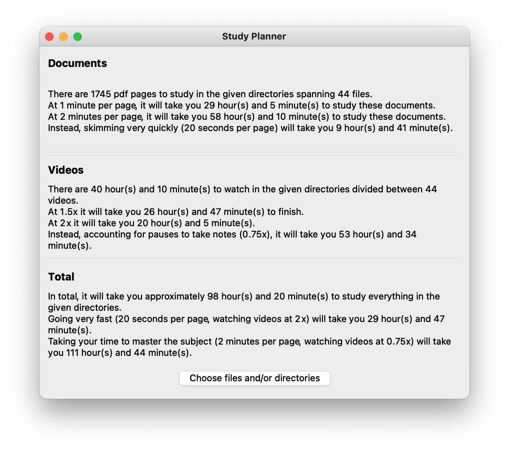

# Study Planner
      

A cross-platform GUI to get a quick analysis from files and/or directories in terms of required time to study their contents

  
  
  

### How to develop
- `git clone https://github.com/e-caste/study-planner`
- `cd study-planner`
- `python3.6 -m venv venv`
- `source venv/bin/activate`
- `pip install -r requirements-dev.txt`
- `python main.py`
