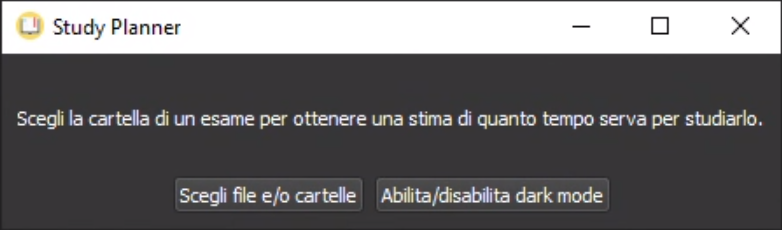

# Study Planner

     

 

A cross-platform GUI to get a quick analysis from files and/or directories in terms of required time to study their contents

  
  
  

### How to run

1. Download the latest release for your platform on the right of this page
2. Decompress the archive
3. Run the application

Some notes on point 3:
- on Windows, you will have to click "More info" and then "Run anyway" in the blue window that appears the first time you run the app
- on macOS, you will have to double click the app while holding control, only then you will have the option to "Open" the app
- on GNU/Linux, if you're using the Nautilus file manager (the default on Ubuntu), you will have to run the app from the terminal since double click does not work properly 

### How to develop
- `git clone https://github.com/e-caste/study-planner`
- `cd study-planner`
- `python3.6 -m venv venv`
- `source venv/bin/activate`
- `pip install -r requirements-dev.txt`
- `python main.py`
